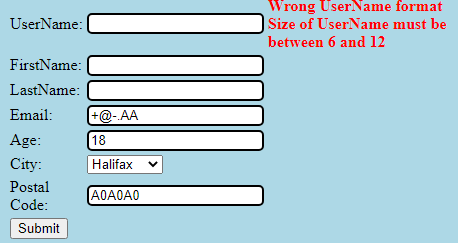
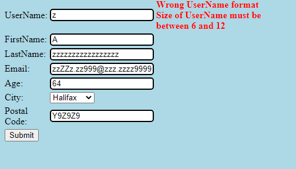
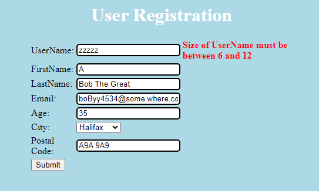
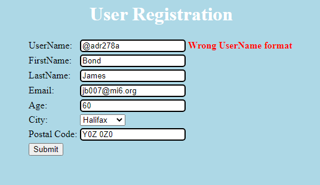

# Lab 02

| Outline | Value |
| --- | --- |
| Course | SEG 3103 |
| Date | Summer 2021 |
| Professor | Andrew Forward, aforward@uottawa.ca |
| TAs | Zahra Kakavand, zkaka044@uottawa.ca & Henry Chen, zchen229@uottawa.ca |
| Student | Youcef Ben Ali - 300110797 |

## Deliverables

* https://github.com/YoucefBenAli/seg3103_playground

------
## Exercise 1

__Test Cases Table Results__:

| Test Case | Expected Results | Actual Results | Verdict |
| --- | --- | --- | --- |
| 1 | Registration request accepted | Registration request accepted | Pass |
| 2 | Registration request accepted | Registration request accepted | Pass |
| 3 | Registration request accepted | Registration request accepted | Pass |
| 4 | Registration request accepted | Registration request accepted | Pass |
| 5 | Err1 | Err1 & Err3 | Fail |
| 6 | Err3 | Err1 & Err3 | Fail |
| 7 | Err3 | Err3 | Pass |
| 8 | Err1 | Err1 | Pass |

__Test Case 1 Actual Result__:


__Test Case 2 Actual Result__:


__Test Case 3 Actual Result__:


__Test Case 4 Actual Result__:


__Test Case 5 Actual Result__:



__Test Case 6 Actual Result__:



__Test Case 7 Actual Result__:



__Test Case 8 Actual Result__:



------

## Exercise 2

__Date Test Cases Compilation & Run Results__:
```bash
harissa@DESKTOP-2DE323U:/mnt/c/users/harissa/documents/School Projects/seg3103_playground/lab02/ecs$ javac -encoding UTF-8 --source-path test -d dist -cp dist:lib/junit-platform-console-standalone-1.7.1.jar test/*.java
harissa@DESKTOP-2DE323U:/mnt/c/users/harissa/documents/School Projects/seg3103_playground/lab02/ecs$ java -jar lib/junit-platform-console-standalone-1.7.1.jar --class-path dist --scan-class-path

Thanks for using JUnit! Support its development at https://junit.org/sponsoring

╷
├─ JUnit Jupiter ✔
│  ├─ DateTest ✔
│  │  ├─ date_setDate_givenDayHigherThan31AndThirdMonth() ✔
│  │  ├─ date_isLeapYear_GivenNonLeapYear() ✔
│  │  ├─ date_equals_givenNotSameDate() ✔
│  │  ├─ nextDate_sample() ✔
│  │  ├─ date_equals_givenSameDate() ✔
│  │  ├─ date_getNextDay_givenEndOfYear() ✔
│  │  ├─ date_getNextDay_givenEndOfMonth() ✔
│  │  ├─ date_setDate_givenNegativeDay() ✔
│  │  ├─ date_setDate_givenMonthBiggerThan12() ✔
│  │  ├─ date_setDate_givenDayHigherThan29AndFebruaryAndLeapYear() ✔
│  │  ├─ date_getYear() ✔
│  │  ├─ date_getDay() ✔
│  │  ├─ date_setDate_givenDayHigherThan29AndFebruaryAndNotLeapYear() ✔
│  │  ├─ date_isLeapYear_GivenLeapYear() ✔
│  │  ├─ date_setDate_givenNegativeMonth() ✔
│  │  ├─ date_setDate_givenDayHigherThan31() ✔
│  │  ├─ date_getMonth() ✔
│  │  ├─ date_toString_givenValidDate() ✔
│  │  ├─ date_setDate_givenNegativeYear() ✔
│  │  └─ date_equals_givenNonDateObject() ✔
│  └─ BitTest ✔
│     ├─ constructor_int_ok() ✔
│     ├─ constructor_int_tooLarge() ✔
│     ├─ constructor_int_tooSmall() ✔
│     ├─ constructor_Bit() ✔
│     ├─ hashCode_values() ✔
│     ├─ getIntValue() ✔
│     ├─ equals() ✔
│     ├─ toString_values() ✔
│     ├─ or() ✔
│     ├─ and() ✔
│     ├─ not() ✔
│     ├─ xor() ✔
│     ├─ setValue() ✔
│     └─ constructor_default_0() ✔
└─ JUnit Vintage ✔
   ├─ BitAndTest ✔
   │  ├─ [0] ✔
   │  │  └─ testAnd[0] ✔
   │  ├─ [1] ✔
   │  │  └─ testAnd[1] ✔
   │  ├─ [2] ✔
   │  │  └─ testAnd[2] ✔
   │  └─ [3] ✔
   │     └─ testAnd[3] ✔
   ├─ DateNextDateOkTest ✔
   │  ├─ [0: testDate_NextDate(1565/February/22)=1565/February/23] ✔
   │  │  └─ testNextDateCorrect[0: testDate_NextDate(1565/February/22)=1565/February/23] ✔
   │  ├─ [1: testDate_NextDate(888/August/8)=888/August/9] ✔
   │  │  └─ testNextDateCorrect[1: testDate_NextDate(888/August/8)=888/August/9] ✔
   │  ├─ [2: testDate_NextDate(888/April/30)=888/May/1] ✔
   │  │  └─ testNextDateCorrect[2: testDate_NextDate(888/April/30)=888/May/1] ✔
   │  ├─ [3: testDate_NextDate(999/May/31)=999/June/1] ✔
   │  │  └─ testNextDateCorrect[3: testDate_NextDate(999/May/31)=999/June/1] ✔
   │  ├─ [4: testDate_NextDate(1700/June/20)=1700/June/21] ✔
   │  │  └─ testNextDateCorrect[4: testDate_NextDate(1700/June/20)=1700/June/21] ✔
   │  ├─ [5: testDate_NextDate(2005/April/15)=2005/April/16] ✔
   │  │  └─ testNextDateCorrect[5: testDate_NextDate(2005/April/15)=2005/April/16] ✔
   │  ├─ [6: testDate_NextDate(1901/July/20)=1901/July/21] ✔
   │  │  └─ testNextDateCorrect[6: testDate_NextDate(1901/July/20)=1901/July/21] ✔
   │  ├─ [7: testDate_NextDate(3456/March/27)=3456/March/28] ✔
   │  │  └─ testNextDateCorrect[7: testDate_NextDate(3456/March/27)=3456/March/28] ✔
   │  ├─ [8: testDate_NextDate(1500/February/17)=1500/February/18] ✔
   │  │  └─ testNextDateCorrect[8: testDate_NextDate(1500/February/17)=1500/February/18] ✔
   │  ├─ [9: testDate_NextDate(1700/June/29)=1700/June/30] ✔
   │  │  └─ testNextDateCorrect[9: testDate_NextDate(1700/June/29)=1700/June/30] ✔
   │  ├─ [10: testDate_NextDate(1800/November/29)=1800/November/30] ✔
   │  │  └─ testNextDateCorrect[10: testDate_NextDate(1800/November/29)=1800/November/30] ✔
   │  ├─ [11: testDate_NextDate(3453/January/29)=3453/January/30] ✔
   │  │  └─ testNextDateCorrect[11: testDate_NextDate(3453/January/29)=3453/January/30] ✔
   │  ├─ [12: testDate_NextDate(444/February/29)=444/March/1] ✔
   │  │  └─ testNextDateCorrect[12: testDate_NextDate(444/February/29)=444/March/1] ✔
   │  ├─ [13: testDate_NextDate(2005/April/30)=2005/May/1] ✔
   │  │  └─ testNextDateCorrect[13: testDate_NextDate(2005/April/30)=2005/May/1] ✔
   │  ├─ [14: testDate_NextDate(3453/January/30)=3453/January/31] ✔
   │  │  └─ testNextDateCorrect[14: testDate_NextDate(3453/January/30)=3453/January/31] ✔
   │  ├─ [15: testDate_NextDate(3456/March/30)=3456/March/31] ✔
   │  │  └─ testNextDateCorrect[15: testDate_NextDate(3456/March/30)=3456/March/31] ✔
   │  ├─ [16: testDate_NextDate(1901/July/31)=1901/August/1] ✔
   │  │  └─ testNextDateCorrect[16: testDate_NextDate(1901/July/31)=1901/August/1] ✔
   │  ├─ [17: testDate_NextDate(3453/January/31)=3453/February/1] ✔
   │  │  └─ testNextDateCorrect[17: testDate_NextDate(3453/January/31)=3453/February/1] ✔
   │  └─ [18: testDate_NextDate(3456/December/31)=3457/January/1] ✔
   │     └─ testNextDateCorrect[18: testDate_NextDate(3456/December/31)=3457/January/1] ✔
   └─ DateNextDateExceptionTest ✔
      ├─ [0] ✔
      │  └─ testNextDateCorrect[0] ✔
      ├─ [1] ✔
      │  └─ testNextDateCorrect[1] ✔
      ├─ [2] ✔
      │  └─ testNextDateCorrect[2] ✔
      ├─ [3] ✔
      │  └─ testNextDateCorrect[3] ✔
      ├─ [4] ✔
      │  └─ testNextDateCorrect[4] ✔
      ├─ [5] ✔
      │  └─ testNextDateCorrect[5] ✔
      ├─ [6] ✔
      │  └─ testNextDateCorrect[6] ✔
      ├─ [7] ✔
      │  └─ testNextDateCorrect[7] ✔
      └─ [8] ✔
         └─ testNextDateCorrect[8] ✔

Test run finished after 121 ms
[        39 containers found      ]
[         0 containers skipped    ]
[        39 containers started    ]
[         0 containers aborted    ]
[        39 containers successful ]
[         0 containers failed     ]
[        66 tests found           ]
[         0 tests skipped         ]
[        66 tests started         ]
[         0 tests aborted         ]
[        66 tests successful      ]
[         0 tests failed          ]
```