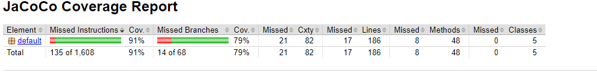
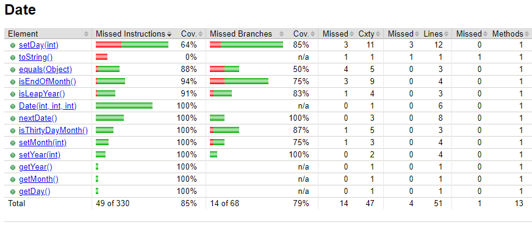
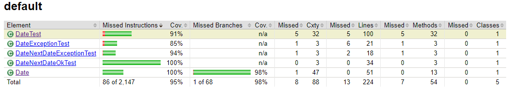
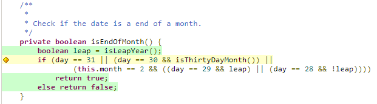
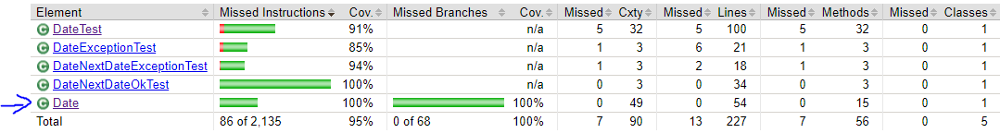

# Lab 03

| Outline | Value |
| --- | --- |
| Course | SEG 3103 |
| Date | Summer 2021 |
| Professor | Andrew Forward, aforward@uottawa.ca |
| TAs | Zahra Kakavand, zkaka044@uottawa.ca & Henry Chen, zchen229@uottawa.ca |
| Student | Youcef Ben Ali - 300110797 |

## Deliverables

* https://github.com/YoucefBenAli/seg3103_playground

## IMPORTANT PLEASE READ

Due to an error I accidentally created a new repository for this lab and pushed all my commits here instead of the parent repository. I wasn't able to transfer the commit history to the parent repository so if you want to examine the commit history for this lab please consult the following repository: https://github.com/YoucefBenAli/seg3103_lab3

------
## Part 1: Attempting 100% Coverage for Date Class

When first running the code, tests and generating the coverage report, the coverage results showed a very low branch coverage of 79% indicating a very incomplete list of tests.

Initial Coverage Results:

However, for this lab I was tasked with attempting to reach a 100% coverage but I was only able to reach a coverage of 98%

Coverage Results after adding test suite:

The reason I could not get to a 100% branch coverage was due to a specific line as follows:

In the image above, one can see that the if statement checks if the month is february and the date is the 29th and that its a leap year. The issue is that we can't get a coverage of the leap year being false while the day is 29 as its impossible. I therefore stopped at a coverage of 98%, to get it higher than that I would have to change the source code.

------

## Part 2 : Refactoring Date.java

For this part of the lab I did small changes such as taking code that was repeated many times and turning it into a method, removing the leap year check that happens after it was verified that the date is the 29th, as well as some small structural changes to the if statements. These changes can be found in the commit history of this repository.

Removing the leap year check actually had a change on the test coverage. In the end, refactoring the code was able to increase the test coverage to 100%.

