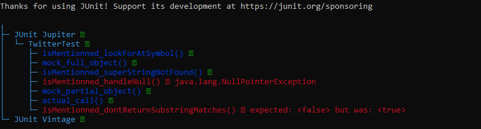
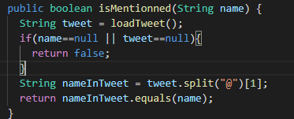
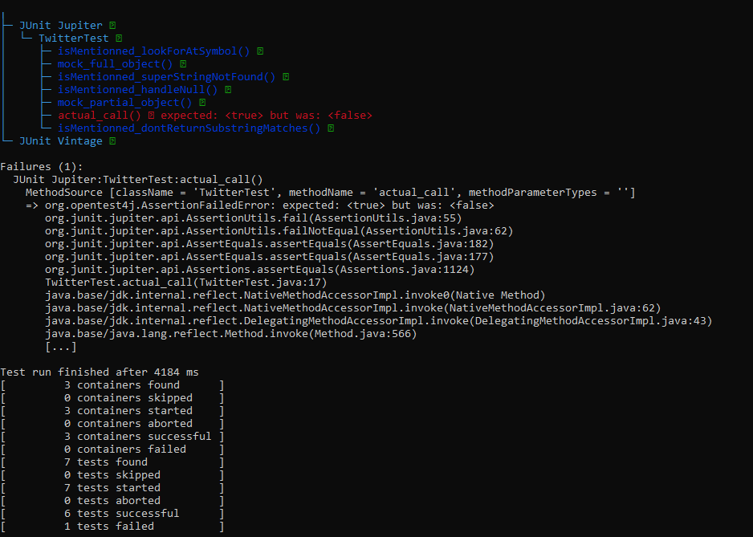

# Lab 05

| Outline | Value |
| --- | --- |
| Course | SEG 3103 |
| Date | Summer 2021 |
| Professor | Andrew Forward, aforward@uottawa.ca |
| TAs | Zahra Kakavand, zkaka044@uottawa.ca & Henry Chen, zchen229@uottawa.ca |
| Student | Youcef Ben Ali - 300110797 |

## Deliverables

* https://github.com/YoucefBenAli/seg3103_playground

------
## Part 1: Grades

When using a stubbed method, I decided to generate a random number between 1 and 100 for the percentage grade and a random element from the list of possible results for the letter grade and numeric grade. 

Here is an example of what the stubbing looks like on the website:

However, when I tried to use the solution we had from assignment 2, no results would be displayed on the website when the calculation was requested. It turns out that there was an arithmetic problem as seen below:

Here is an example of what the stubbing looks like on the website:

This is actually an excellent example of the importance of integration testing. Individually the calculator.ex file passed all tests and had no issues with it whatsoever. However, without having used integration testing we did not know that the methods in that file would not work when working with the website since the website gave arguments in string form rather than integer form. Therefore, to fix this problem we would need to adjust the methods so that the results are converted from string form to integer form before performing the calculations

------
## Part 2: Twitter

Initially not all test cases worked for the code provided to us. As can be seen in the screenshot below the handleNull and dontReturnSubstring methods were not passing

After examining the source code I realized that the reason why was the isMentioned method does not have code handling null values and that the code to check who was tagged in the tweet only checks that the name is a substring and not if its equal to the whole string after the "@". Here are the code changes I added to fix this:

The final test results can be seen below:

As can be seen in the screenshot the actual_call test did not work but that is simply due to the way the code for load_tweet works. The function uses a random number generator to generate a string and has a 45% change of getting the string contianing the correct name for the test to pass and a 55% change of it returning a string with the incorrect name expected from the test.
