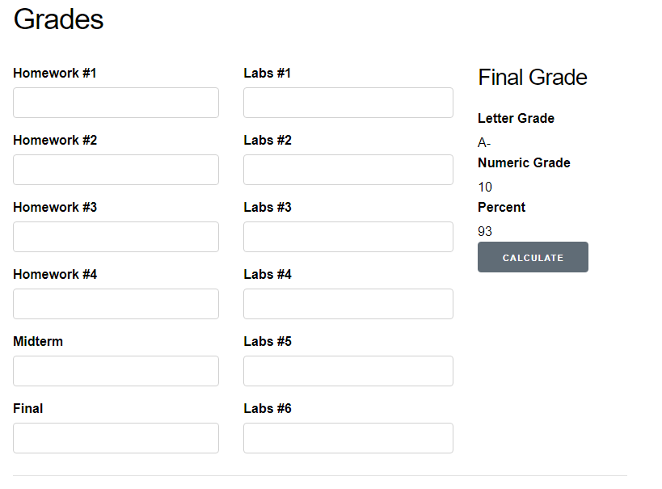
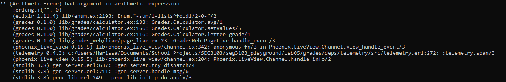

# Lab 05

| Outline | Value |
| --- | --- |
| Course | SEG 3103 |
| Date | Summer 2021 |
| Professor | Andrew Forward, aforward@uottawa.ca |
| TAs | Zahra Kakavand, zkaka044@uottawa.ca & Henry Chen, zchen229@uottawa.ca |
| Student | Youcef Ben Ali - 300110797 |

## Deliverables

* https://github.com/YoucefBenAli/seg3103_playground

------
## Part 1: Grades

When using a stubbed method, I decided to generate a random number between 1 and 100 for the percentage grade and a random element from the list of possible results for the letter grade and numeric grade. 

Here is an example of what the stubbing looks like on the website:

However, when I tried to use the solution we had from assignment 2, no results would be displayed on the website when the calculation was requested. It turns out that there was an arithmetic problem as seen below:

Here is an example of what the stubbing looks like on the website:

This is actually an excellent example of the importance of integration testing. Individually the calculator.ex file passed all tests and had no issues with it whatsoever. However, without having used integration testing we did not know that the methods in that file would not work when working with the website since the website gave arguments in string form rather than integer form. Therefore, to fix this problem we would need to adjust the methods so that the results are converted from string form to integer form before performing the calculations