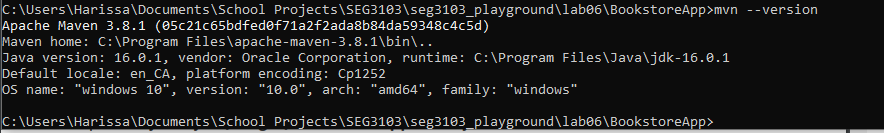
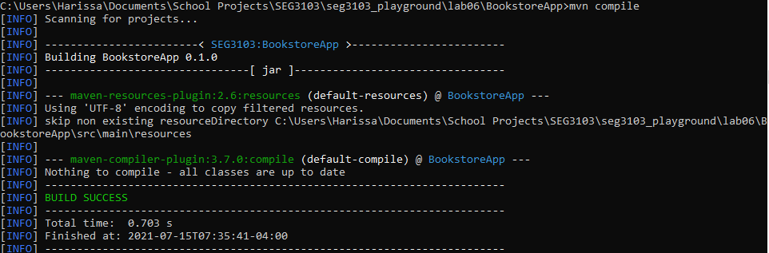
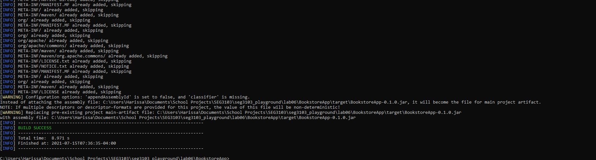
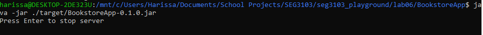
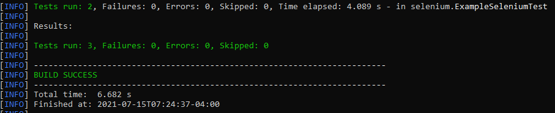
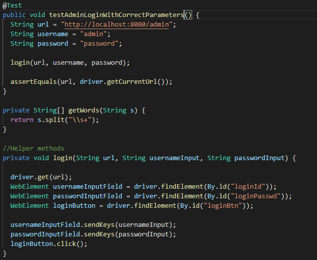
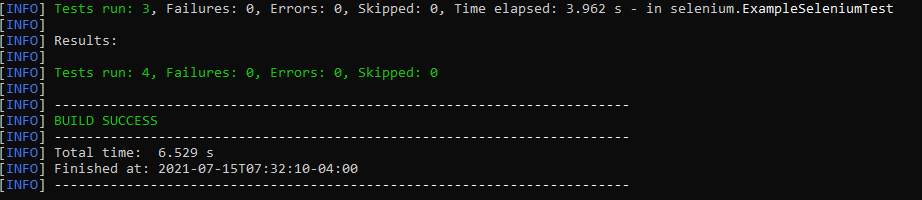

# Lab 05

| Outline | Value |
| --- | --- |
| Course | SEG 3103 |
| Date | Summer 2021 |
| Professor | Andrew Forward, aforward@uottawa.ca |
| TAs | Zahra Kakavand, zkaka044@uottawa.ca & Henry Chen, zchen229@uottawa.ca |
| Student | Youcef Ben Ali - 300110797 |

## Deliverables

* https://github.com/YoucefBenAli/seg3103_playground


------
## Part 1: Grades

Here is proof of mvn version working



Here is proof of mvn compile working



Here is proof of mvn Package -DskipTests working, there is additional proof at the bottom since it was very long



Here is proof of running the java jar file and the resulting program




Here is proof of mvn test working before the additional test:



Here is my additional Test:



Here is proof of my mvn test working after the extra test:




Here is the full text from running mvn package -DskipTests
```
C:\Users\Harissa\Documents\School Projects\SEG3103\seg3103_playground\lab06\BookstoreApp>mvn package -DskipTests
[INFO] Scanning for projects...
[INFO]
[INFO] ------------------------< SEG3103:BookstoreApp >------------------------
[INFO] Building BookstoreApp 0.1.0
[INFO] --------------------------------[ jar ]---------------------------------
[INFO]
[INFO] --- maven-resources-plugin:2.6:resources (default-resources) @ BookstoreApp ---
[INFO] Using 'UTF-8' encoding to copy filtered resources.
[INFO] skip non existing resourceDirectory C:\Users\Harissa\Documents\School Projects\SEG3103\seg3103_playground\lab06\BookstoreApp\src\main\resources
[INFO]
[INFO] --- maven-compiler-plugin:3.7.0:compile (default-compile) @ BookstoreApp ---
[INFO] Nothing to compile - all classes are up to date
[INFO]
[INFO] --- maven-resources-plugin:2.6:testResources (default-testResources) @ BookstoreApp ---
[INFO] Using 'UTF-8' encoding to copy filtered resources.
[INFO] skip non existing resourceDirectory C:\Users\Harissa\Documents\School Projects\SEG3103\seg3103_playground\lab06\BookstoreApp\src\test\resources
[INFO]
[INFO] --- maven-compiler-plugin:3.7.0:testCompile (default-testCompile) @ BookstoreApp ---
[INFO] Nothing to compile - all classes are up to date
[INFO]
[INFO] --- maven-surefire-plugin:2.22.1:test (default-test) @ BookstoreApp ---
[INFO] Tests are skipped.
[INFO]
[INFO] --- maven-jar-plugin:2.4:jar (default-jar) @ BookstoreApp ---
[INFO]
[INFO] --- maven-assembly-plugin:2.2-beta-5:single (make-assembly) @ BookstoreApp ---
[INFO] META-INF/ already added, skipping
[INFO] META-INF/MANIFEST.MF already added, skipping
[INFO] META-INF/ already added, skipping
[INFO] META-INF/MANIFEST.MF already added, skipping
[INFO] META-INF/versions/ already added, skipping
[INFO] META-INF/versions/9 already added, skipping
[INFO] META-INF/versions/9/ already added, skipping
[INFO] META-INF/versions/9/module-info.class already added, skipping
[INFO] org/ already added, skipping
[INFO] org/openqa/ already added, skipping
[INFO] org/openqa/selenium/ already added, skipping
[INFO] META-INF/ already added, skipping
[INFO] META-INF/MANIFEST.MF already added, skipping
[INFO] META-INF/versions/ already added, skipping
[INFO] META-INF/versions/9 already added, skipping
[INFO] META-INF/versions/9/ already added, skipping
[INFO] META-INF/versions/9/module-info.class already added, skipping
[INFO] org/ already added, skipping
[INFO] org/openqa/ already added, skipping
[INFO] org/openqa/selenium/ already added, skipping
[INFO] META-INF/ already added, skipping
[INFO] META-INF/MANIFEST.MF already added, skipping
[INFO] META-INF/ already added, skipping
[INFO] META-INF/MANIFEST.MF already added, skipping
[INFO] org/ already added, skipping
[INFO] META-INF/maven/ already added, skipping
[INFO] META-INF/MANIFEST.MF already added, skipping
[INFO] META-INF/ already added, skipping
[INFO] META-INF/maven/ already added, skipping
[INFO] META-INF/ already added, skipping
[INFO] META-INF/MANIFEST.MF already added, skipping
[INFO] META-INF/ already added, skipping
[INFO] META-INF/MANIFEST.MF already added, skipping
[INFO] org/ already added, skipping
[INFO] META-INF/ already added, skipping
[INFO] META-INF/MANIFEST.MF already added, skipping
[INFO] com/ already added, skipping
[INFO] com/google/ already added, skipping
[INFO] META-INF/maven/ already added, skipping
[INFO] META-INF/ already added, skipping
[INFO] META-INF/MANIFEST.MF already added, skipping
[INFO] com/ already added, skipping
[INFO] com/google/ already added, skipping
[INFO] META-INF/maven/ already added, skipping
[INFO] META-INF/ already added, skipping
[INFO] META-INF/MANIFEST.MF already added, skipping
[INFO] org/ already added, skipping
[INFO] META-INF/maven/ already added, skipping
[INFO] META-INF/MANIFEST.MF already added, skipping
[INFO] META-INF/ already added, skipping
[INFO] META-INF/maven/ already added, skipping
[INFO] META-INF/ already added, skipping
[INFO] META-INF/MANIFEST.MF already added, skipping
[INFO] META-INF/maven/ already added, skipping
[INFO] META-INF/ already added, skipping
[INFO] META-INF/MANIFEST.MF already added, skipping
[INFO] META-INF/services/ already added, skipping
[INFO] META-INF/versions/ already added, skipping
[INFO] META-INF/versions/9 already added, skipping
[INFO] META-INF/versions/9/ already added, skipping
[INFO] META-INF/versions/9/module-info.class already added, skipping
[INFO] org/ already added, skipping
[INFO] org/openqa/ already added, skipping
[INFO] org/openqa/selenium/ already added, skipping
[INFO] META-INF/services/org.openqa.selenium.remote.service.DriverService$Builder already added, skipping
[INFO] META-INF/services/org.openqa.selenium.WebDriverInfo already added, skipping
[INFO] META-INF/ already added, skipping
[INFO] META-INF/MANIFEST.MF already added, skipping
[INFO] META-INF/services/ already added, skipping
[INFO] META-INF/versions/ already added, skipping
[INFO] META-INF/versions/9 already added, skipping
[INFO] META-INF/versions/9/ already added, skipping
[INFO] META-INF/versions/9/module-info.class already added, skipping
[INFO] org/ already added, skipping
[INFO] org/openqa/ already added, skipping
[INFO] org/openqa/selenium/ already added, skipping
[INFO] META-INF/services/org.openqa.selenium.remote.service.DriverService$Builder already added, skipping
[INFO] META-INF/services/org.openqa.selenium.WebDriverInfo already added, skipping
[INFO] META-INF/ already added, skipping
[INFO] META-INF/MANIFEST.MF already added, skipping
[INFO] META-INF/services/ already added, skipping
[INFO] META-INF/versions/ already added, skipping
[INFO] META-INF/versions/9 already added, skipping
[INFO] META-INF/versions/9/ already added, skipping
[INFO] META-INF/versions/9/module-info.class already added, skipping
[INFO] org/ already added, skipping
[INFO] org/openqa/ already added, skipping
[INFO] org/openqa/selenium/ already added, skipping
[INFO] META-INF/services/org.openqa.selenium.remote.service.DriverService$Builder already added, skipping
[INFO] META-INF/services/org.openqa.selenium.WebDriverInfo already added, skipping
[INFO] META-INF/ already added, skipping
[INFO] META-INF/MANIFEST.MF already added, skipping
[INFO] META-INF/services/ already added, skipping
[INFO] META-INF/versions/ already added, skipping
[INFO] META-INF/versions/9 already added, skipping
[INFO] META-INF/versions/9/ already added, skipping
[INFO] META-INF/versions/9/module-info.class already added, skipping
[INFO] org/ already added, skipping
[INFO] org/openqa/ already added, skipping
[INFO] org/openqa/selenium/ already added, skipping
[INFO] META-INF/services/org.openqa.selenium.remote.service.DriverService$Builder already added, skipping
[INFO] META-INF/services/org.openqa.selenium.WebDriverInfo already added, skipping
[INFO] META-INF/ already added, skipping
[INFO] META-INF/MANIFEST.MF already added, skipping
[INFO] META-INF/services/ already added, skipping
[INFO] META-INF/versions/ already added, skipping
[INFO] META-INF/versions/9 already added, skipping
[INFO] META-INF/versions/9/ already added, skipping
[INFO] META-INF/versions/9/module-info.class already added, skipping
[INFO] org/ already added, skipping
[INFO] org/openqa/ already added, skipping
[INFO] org/openqa/selenium/ already added, skipping
[INFO] META-INF/services/org.openqa.selenium.remote.service.DriverService$Builder already added, skipping
[INFO] META-INF/services/org.openqa.selenium.WebDriverInfo already added, skipping
[INFO] META-INF/ already added, skipping
[INFO] META-INF/MANIFEST.MF already added, skipping
[INFO] org/ already added, skipping
[INFO] org/openqa/ already added, skipping
[INFO] org/openqa/selenium/ already added, skipping
[INFO] META-INF/ already added, skipping
[INFO] META-INF/MANIFEST.MF already added, skipping
[INFO] org/ already added, skipping
[INFO] org/openqa/ already added, skipping
[INFO] org/openqa/selenium/ already added, skipping
[INFO] META-INF/maven/ already added, skipping
[INFO] META-INF/MANIFEST.MF already added, skipping
[INFO] META-INF/ already added, skipping
[INFO] com/ already added, skipping
[INFO] META-INF/ already added, skipping
[INFO] META-INF/MANIFEST.MF already added, skipping
[INFO] META-INF/services/ already added, skipping
[INFO] org/ already added, skipping
[INFO] org/apache/ already added, skipping
[INFO] META-INF/ already added, skipping
[INFO] META-INF/MANIFEST.MF already added, skipping
[INFO] org/ already added, skipping
[INFO] org/apache/ already added, skipping
[INFO] org/apache/xml/ already added, skipping
[INFO] org/apache/xml/serializer/ already added, skipping
[INFO] META-INF/MANIFEST.MF already added, skipping
[INFO] META-INF/ already added, skipping
[INFO] org/ already added, skipping
[INFO] org/apache/ already added, skipping
[INFO] org/apache/commons/ already added, skipping
[INFO] META-INF/maven/ already added, skipping
[INFO] META-INF/maven/org.apache.commons/ already added, skipping
[INFO] META-INF/LICENSE.txt already added, skipping
[INFO] META-INF/NOTICE.txt already added, skipping
[INFO] META-INF/MANIFEST.MF already added, skipping
[INFO] META-INF/ already added, skipping
[INFO] org/ already added, skipping
[INFO] org/apache/ already added, skipping
[INFO] org/apache/commons/ already added, skipping
[INFO] META-INF/maven/ already added, skipping
[INFO] META-INF/maven/org.apache.commons/ already added, skipping
[INFO] META-INF/LICENSE.txt already added, skipping
[INFO] META-INF/NOTICE.txt already added, skipping
[INFO] META-INF/MANIFEST.MF already added, skipping
[INFO] META-INF/ already added, skipping
[INFO] org/ already added, skipping
[INFO] org/apache/ already added, skipping
[INFO] META-INF/maven/ already added, skipping
[INFO] META-INF/MANIFEST.MF already added, skipping
[INFO] META-INF/ already added, skipping
[INFO] org/ already added, skipping
[INFO] org/apache/ already added, skipping
[INFO] org/apache/http/ already added, skipping
[INFO] META-INF/maven/ already added, skipping
[INFO] META-INF/maven/org.apache.httpcomponents/ already added, skipping
[INFO] META-INF/LICENSE already added, skipping
[INFO] META-INF/NOTICE already added, skipping
[INFO] META-INF/DEPENDENCIES already added, skipping
[INFO] META-INF/MANIFEST.MF already added, skipping
[INFO] META-INF/ already added, skipping
[INFO] org/ already added, skipping
[INFO] org/apache/ already added, skipping
[INFO] org/apache/http/ already added, skipping
[INFO] org/apache/http/impl/ already added, skipping
[INFO] org/apache/http/entity/ already added, skipping
[INFO] META-INF/maven/ already added, skipping
[INFO] META-INF/maven/org.apache.httpcomponents/ already added, skipping
[INFO] META-INF/NOTICE already added, skipping
[INFO] META-INF/DEPENDENCIES already added, skipping
[INFO] META-INF/LICENSE already added, skipping
[INFO] META-INF/ already added, skipping
[INFO] META-INF/MANIFEST.MF already added, skipping
[INFO] org/ already added, skipping
[INFO] org/apache/ already added, skipping
[INFO] org/apache/commons/ already added, skipping
[INFO] META-INF/NOTICE.txt already added, skipping
[INFO] META-INF/LICENSE.txt already added, skipping
[INFO] META-INF/maven/ already added, skipping
[INFO] META-INF/MANIFEST.MF already added, skipping
[INFO] META-INF/ already added, skipping
[INFO] org/ already added, skipping
[INFO] org/apache/ already added, skipping
[INFO] org/apache/commons/ already added, skipping
[INFO] META-INF/maven/ already added, skipping
[INFO] META-INF/LICENSE.txt already added, skipping
[INFO] META-INF/NOTICE.txt already added, skipping
[INFO] META-INF/ already added, skipping
[INFO] META-INF/MANIFEST.MF already added, skipping
[INFO] net/ already added, skipping
[INFO] META-INF/MANIFEST.MF already added, skipping
[INFO] META-INF/ already added, skipping
[INFO] net/ already added, skipping
[INFO] net/sourceforge/ already added, skipping
[INFO] net/sourceforge/htmlunit/ already added, skipping
[INFO] META-INF/ already added, skipping
[INFO] META-INF/MANIFEST.MF already added, skipping
[INFO] META-INF/services/ already added, skipping
[INFO] org/ already added, skipping
[INFO] org/apache/ already added, skipping
[INFO] org/apache/xml/ already added, skipping
[INFO] META-INF/LICENSE already added, skipping
[INFO] META-INF/NOTICE already added, skipping
[INFO] META-INF/ already added, skipping
[INFO] META-INF/MANIFEST.MF already added, skipping
[INFO] javax/ already added, skipping
[INFO] org/ already added, skipping
[INFO] org/apache/ already added, skipping
[INFO] org/w3c/ already added, skipping
[INFO] org/w3c/dom/ already added, skipping
[INFO] org/w3c/dom/html/ already added, skipping
[INFO] META-INF/MANIFEST.MF already added, skipping
[INFO] META-INF/ already added, skipping
[INFO] com/ already added, skipping
[INFO] com/gargoylesoftware/ already added, skipping
[INFO] META-INF/MANIFEST.MF already added, skipping
[INFO] META-INF/ already added, skipping
[INFO] org/ already added, skipping
[INFO] org/apache/ already added, skipping
[INFO] org/apache/commons/ already added, skipping
[INFO] META-INF/maven/ already added, skipping
[INFO] META-INF/LICENSE.txt already added, skipping
[INFO] META-INF/NOTICE.txt already added, skipping
[INFO] META-INF/MANIFEST.MF already added, skipping
[INFO] META-INF/ already added, skipping
[INFO] org/ already added, skipping
[INFO] org/apache/ already added, skipping
[INFO] org/apache/commons/ already added, skipping
[INFO] META-INF/maven/ already added, skipping
[INFO] META-INF/LICENSE.txt already added, skipping
[INFO] META-INF/NOTICE.txt already added, skipping
[INFO] META-INF/MANIFEST.MF already added, skipping
[INFO] META-INF/ already added, skipping
[INFO] org/ already added, skipping
[INFO] META-INF/maven/ already added, skipping
[INFO] META-INF/MANIFEST.MF already added, skipping
[INFO] META-INF/ already added, skipping
[INFO] org/ already added, skipping
[INFO] org/eclipse/ already added, skipping
[INFO] org/eclipse/jetty/ already added, skipping
[INFO] META-INF/maven/ already added, skipping
[INFO] about.html already added, skipping
[INFO] META-INF/MANIFEST.MF already added, skipping
[INFO] META-INF/ already added, skipping
[INFO] org/ already added, skipping
[INFO] org/eclipse/ already added, skipping
[INFO] org/eclipse/jetty/ already added, skipping
[INFO] META-INF/services/ already added, skipping
[INFO] META-INF/maven/ already added, skipping
[INFO] META-INF/maven/org.eclipse.jetty/ already added, skipping
[INFO] about.html already added, skipping
[INFO] META-INF/MANIFEST.MF already added, skipping
[INFO] META-INF/ already added, skipping
[INFO] org/ already added, skipping
[INFO] org/eclipse/ already added, skipping
[INFO] org/eclipse/jetty/ already added, skipping
[INFO] META-INF/maven/ already added, skipping
[INFO] META-INF/maven/org.eclipse.jetty/ already added, skipping
[INFO] about.html already added, skipping
[INFO] META-INF/MANIFEST.MF already added, skipping
[INFO] META-INF/ already added, skipping
[INFO] org/ already added, skipping
[INFO] org/eclipse/ already added, skipping
[INFO] org/eclipse/jetty/ already added, skipping
[INFO] META-INF/maven/ already added, skipping
[INFO] META-INF/maven/org.eclipse.jetty/ already added, skipping
[INFO] about.html already added, skipping
[INFO] META-INF/MANIFEST.MF already added, skipping
[INFO] META-INF/ already added, skipping
[INFO] org/ already added, skipping
[INFO] org/eclipse/ already added, skipping
[INFO] org/eclipse/jetty/ already added, skipping
[INFO] META-INF/maven/ already added, skipping
[INFO] META-INF/maven/org.eclipse.jetty/ already added, skipping
[INFO] about.html already added, skipping
[INFO] META-INF/MANIFEST.MF already added, skipping
[INFO] META-INF/ already added, skipping
[INFO] org/ already added, skipping
[INFO] org/eclipse/ already added, skipping
[INFO] org/eclipse/jetty/ already added, skipping
[INFO] org/eclipse/jetty/websocket/ already added, skipping
[INFO] META-INF/services/ already added, skipping
[INFO] META-INF/maven/ already added, skipping
[INFO] META-INF/maven/org.eclipse.jetty.websocket/ already added, skipping
[INFO] about.html already added, skipping
[INFO] META-INF/MANIFEST.MF already added, skipping
[INFO] META-INF/ already added, skipping
[INFO] org/ already added, skipping
[INFO] org/eclipse/ already added, skipping
[INFO] org/eclipse/jetty/ already added, skipping
[INFO] org/eclipse/jetty/websocket/ already added, skipping
[INFO] META-INF/maven/ already added, skipping
[INFO] META-INF/maven/org.eclipse.jetty.websocket/ already added, skipping
[INFO] about.html already added, skipping
[INFO] META-INF/ already added, skipping
[INFO] META-INF/MANIFEST.MF already added, skipping
[INFO] org/ already added, skipping
[INFO] org/openqa/ already added, skipping
[INFO] org/openqa/selenium/ already added, skipping
[INFO] org/openqa/selenium/remote/ already added, skipping
[INFO] META-INF/ already added, skipping
[INFO] META-INF/MANIFEST.MF already added, skipping
[INFO] META-INF/ already added, skipping
[INFO] META-INF/MANIFEST.MF already added, skipping
[INFO] net/ already added, skipping
[INFO] META-INF/ already added, skipping
[INFO] META-INF/MANIFEST.MF already added, skipping
[INFO] META-INF/maven/ already added, skipping
[INFO] META-INF/maven/org.eclipse.jetty/ already added, skipping
[INFO] META-INF/maven/org.eclipse.jetty/jetty-http/ already added, skipping
[INFO] META-INF/maven/org.eclipse.jetty/jetty-http/pom.properties already added, skipping
[INFO] META-INF/maven/org.eclipse.jetty/jetty-http/pom.xml already added, skipping
[INFO] META-INF/maven/org.eclipse.jetty/jetty-io/ already added, skipping
[INFO] META-INF/maven/org.eclipse.jetty/jetty-io/pom.properties already added, skipping
[INFO] META-INF/maven/org.eclipse.jetty/jetty-io/pom.xml already added, skipping
[INFO] META-INF/maven/org.eclipse.jetty/jetty-util/ already added, skipping
[INFO] META-INF/maven/org.eclipse.jetty/jetty-util/pom.properties already added, skipping
[INFO] META-INF/maven/org.eclipse.jetty/jetty-util/pom.xml already added, skipping
[INFO] META-INF/maven/org.eclipse.jetty/jetty-xml/ already added, skipping
[INFO] META-INF/maven/org.eclipse.jetty/jetty-xml/pom.properties already added, skipping
[INFO] META-INF/maven/org.eclipse.jetty/jetty-xml/pom.xml already added, skipping
[INFO] META-INF/services/ already added, skipping
[INFO] about.html already added, skipping
[INFO] about.html already added, skipping
[INFO] about.html already added, skipping
[INFO] about.html already added, skipping
[INFO] about.html already added, skipping
[INFO] about.html already added, skipping
[INFO] about.html already added, skipping
[INFO] about.html already added, skipping
[INFO] jetty-dir.css already added, skipping
[INFO] org/ already added, skipping
[INFO] META-INF/services/org.eclipse.jetty.http.HttpFieldPreEncoder already added, skipping
[INFO] META-INF/ already added, skipping
[INFO] META-INF/MANIFEST.MF already added, skipping
[INFO] javax/ already added, skipping
[INFO] META-INF/LICENSE.txt already added, skipping
[INFO] META-INF/maven/ already added, skipping
[INFO] META-INF/MANIFEST.MF already added, skipping
[INFO] META-INF/ already added, skipping
[INFO] META-INF/maven/ already added, skipping
[INFO] org/ already added, skipping
[INFO] META-INF/MANIFEST.MF already added, skipping
[INFO] META-INF/ already added, skipping
[INFO] META-INF/maven/ already added, skipping
[INFO] META-INF/ already added, skipping
[INFO] META-INF/MANIFEST.MF already added, skipping
[INFO] org/ already added, skipping
[INFO] META-INF/maven/ already added, skipping
[INFO] META-INF/ already added, skipping
[INFO] META-INF/MANIFEST.MF already added, skipping
[INFO] com/ already added, skipping
[INFO] com/google/ already added, skipping
[INFO] META-INF/maven/ already added, skipping
[INFO] META-INF/MANIFEST.MF already added, skipping
[INFO] META-INF/ already added, skipping
[INFO] org/ already added, skipping
[INFO] org/apache/ already added, skipping
[INFO] mozilla/ already added, skipping
[INFO] META-INF/maven/ already added, skipping
[INFO] META-INF/NOTICE already added, skipping
[INFO] META-INF/LICENSE already added, skipping
[INFO] mozilla/public-suffix-list.txt already added, skipping
[INFO] META-INF/DEPENDENCIES already added, skipping
[INFO] META-INF/MANIFEST.MF already added, skipping
[INFO] META-INF/ already added, skipping
[INFO] org/ already added, skipping
[INFO] org/apache/ already added, skipping
[INFO] org/apache/hc/ already added, skipping
[INFO] META-INF/maven/ already added, skipping
[INFO] META-INF/LICENSE already added, skipping
[INFO] META-INF/DEPENDENCIES already added, skipping
[INFO] META-INF/NOTICE already added, skipping
[INFO] META-INF/MANIFEST.MF already added, skipping
[INFO] META-INF/ already added, skipping
[INFO] org/ already added, skipping
[INFO] org/apache/ already added, skipping
[INFO] org/apache/hc/ already added, skipping
[INFO] org/apache/hc/core5/ already added, skipping
[INFO] META-INF/maven/ already added, skipping
[INFO] META-INF/maven/org.apache.httpcomponents.core5/ already added, skipping
[INFO] META-INF/LICENSE already added, skipping
[INFO] META-INF/DEPENDENCIES already added, skipping
[INFO] META-INF/NOTICE already added, skipping
[INFO] META-INF/MANIFEST.MF already added, skipping
[INFO] META-INF/ already added, skipping
[INFO] META-INF/maven/ already added, skipping
[INFO] org/ already added, skipping
[INFO] META-INF/MANIFEST.MF already added, skipping
[INFO] META-INF/ already added, skipping
[INFO] org/ already added, skipping
[INFO] org/apache/ already added, skipping
[INFO] org/apache/commons/ already added, skipping
[INFO] META-INF/maven/ already added, skipping
[INFO] META-INF/maven/org.apache.commons/ already added, skipping
[INFO] META-INF/LICENSE.txt already added, skipping
[INFO] META-INF/NOTICE.txt already added, skipping
[INFO] META-INF/MANIFEST.MF already added, skipping
[INFO] META-INF/ already added, skipping
[INFO] org/ already added, skipping
[INFO] META-INF/maven/ already added, skipping
[INFO] META-INF/LICENSE already added, skipping
[INFO] Building jar: C:\Users\Harissa\Documents\School Projects\SEG3103\seg3103_playground\lab06\BookstoreApp\target\BookstoreApp-0.1.0.jar
[INFO] META-INF/ already added, skipping
[INFO] META-INF/MANIFEST.MF already added, skipping
[INFO] META-INF/ already added, skipping
[INFO] META-INF/MANIFEST.MF already added, skipping
[INFO] META-INF/versions/ already added, skipping
[INFO] META-INF/versions/9 already added, skipping
[INFO] META-INF/versions/9/ already added, skipping
[INFO] META-INF/versions/9/module-info.class already added, skipping
[INFO] org/ already added, skipping
[INFO] org/openqa/ already added, skipping
[INFO] org/openqa/selenium/ already added, skipping
[INFO] META-INF/ already added, skipping
[INFO] META-INF/MANIFEST.MF already added, skipping
[INFO] META-INF/versions/ already added, skipping
[INFO] META-INF/versions/9 already added, skipping
[INFO] META-INF/versions/9/ already added, skipping
[INFO] META-INF/versions/9/module-info.class already added, skipping
[INFO] org/ already added, skipping
[INFO] org/openqa/ already added, skipping
[INFO] org/openqa/selenium/ already added, skipping
[INFO] META-INF/ already added, skipping
[INFO] META-INF/MANIFEST.MF already added, skipping
[INFO] META-INF/ already added, skipping
[INFO] META-INF/MANIFEST.MF already added, skipping
[INFO] org/ already added, skipping
[INFO] META-INF/maven/ already added, skipping
[INFO] META-INF/MANIFEST.MF already added, skipping
[INFO] META-INF/ already added, skipping
[INFO] META-INF/maven/ already added, skipping
[INFO] META-INF/ already added, skipping
[INFO] META-INF/MANIFEST.MF already added, skipping
[INFO] META-INF/ already added, skipping
[INFO] META-INF/MANIFEST.MF already added, skipping
[INFO] org/ already added, skipping
[INFO] META-INF/ already added, skipping
[INFO] META-INF/MANIFEST.MF already added, skipping
[INFO] com/ already added, skipping
[INFO] com/google/ already added, skipping
[INFO] META-INF/maven/ already added, skipping
[INFO] META-INF/ already added, skipping
[INFO] META-INF/MANIFEST.MF already added, skipping
[INFO] com/ already added, skipping
[INFO] com/google/ already added, skipping
[INFO] META-INF/maven/ already added, skipping
[INFO] META-INF/ already added, skipping
[INFO] META-INF/MANIFEST.MF already added, skipping
[INFO] org/ already added, skipping
[INFO] META-INF/maven/ already added, skipping
[INFO] META-INF/MANIFEST.MF already added, skipping
[INFO] META-INF/ already added, skipping
[INFO] META-INF/maven/ already added, skipping
[INFO] META-INF/ already added, skipping
[INFO] META-INF/MANIFEST.MF already added, skipping
[INFO] META-INF/maven/ already added, skipping
[INFO] META-INF/ already added, skipping
[INFO] META-INF/MANIFEST.MF already added, skipping
[INFO] META-INF/services/ already added, skipping
[INFO] META-INF/versions/ already added, skipping
[INFO] META-INF/versions/9 already added, skipping
[INFO] META-INF/versions/9/ already added, skipping
[INFO] META-INF/versions/9/module-info.class already added, skipping
[INFO] org/ already added, skipping
[INFO] org/openqa/ already added, skipping
[INFO] org/openqa/selenium/ already added, skipping
[INFO] META-INF/services/org.openqa.selenium.remote.service.DriverService$Builder already added, skipping
[INFO] META-INF/services/org.openqa.selenium.WebDriverInfo already added, skipping
[INFO] META-INF/ already added, skipping
[INFO] META-INF/MANIFEST.MF already added, skipping
[INFO] META-INF/services/ already added, skipping
[INFO] META-INF/versions/ already added, skipping
[INFO] META-INF/versions/9 already added, skipping
[INFO] META-INF/versions/9/ already added, skipping
[INFO] META-INF/versions/9/module-info.class already added, skipping
[INFO] org/ already added, skipping
[INFO] org/openqa/ already added, skipping
[INFO] org/openqa/selenium/ already added, skipping
[INFO] META-INF/services/org.openqa.selenium.remote.service.DriverService$Builder already added, skipping
[INFO] META-INF/services/org.openqa.selenium.WebDriverInfo already added, skipping
[INFO] META-INF/ already added, skipping
[INFO] META-INF/MANIFEST.MF already added, skipping
[INFO] META-INF/services/ already added, skipping
[INFO] META-INF/versions/ already added, skipping
[INFO] META-INF/versions/9 already added, skipping
[INFO] META-INF/versions/9/ already added, skipping
[INFO] META-INF/versions/9/module-info.class already added, skipping
[INFO] org/ already added, skipping
[INFO] org/openqa/ already added, skipping
[INFO] org/openqa/selenium/ already added, skipping
[INFO] META-INF/services/org.openqa.selenium.remote.service.DriverService$Builder already added, skipping
[INFO] META-INF/services/org.openqa.selenium.WebDriverInfo already added, skipping
[INFO] META-INF/ already added, skipping
[INFO] META-INF/MANIFEST.MF already added, skipping
[INFO] META-INF/services/ already added, skipping
[INFO] META-INF/versions/ already added, skipping
[INFO] META-INF/versions/9 already added, skipping
[INFO] META-INF/versions/9/ already added, skipping
[INFO] META-INF/versions/9/module-info.class already added, skipping
[INFO] org/ already added, skipping
[INFO] org/openqa/ already added, skipping
[INFO] org/openqa/selenium/ already added, skipping
[INFO] META-INF/services/org.openqa.selenium.remote.service.DriverService$Builder already added, skipping
[INFO] META-INF/services/org.openqa.selenium.WebDriverInfo already added, skipping
[INFO] META-INF/ already added, skipping
[INFO] META-INF/MANIFEST.MF already added, skipping
[INFO] META-INF/services/ already added, skipping
[INFO] META-INF/versions/ already added, skipping
[INFO] META-INF/versions/9 already added, skipping
[INFO] META-INF/versions/9/ already added, skipping
[INFO] META-INF/versions/9/module-info.class already added, skipping
[INFO] org/ already added, skipping
[INFO] org/openqa/ already added, skipping
[INFO] org/openqa/selenium/ already added, skipping
[INFO] META-INF/services/org.openqa.selenium.remote.service.DriverService$Builder already added, skipping
[INFO] META-INF/services/org.openqa.selenium.WebDriverInfo already added, skipping
[INFO] META-INF/ already added, skipping
[INFO] META-INF/MANIFEST.MF already added, skipping
[INFO] org/ already added, skipping
[INFO] org/openqa/ already added, skipping
[INFO] org/openqa/selenium/ already added, skipping
[INFO] META-INF/ already added, skipping
[INFO] META-INF/MANIFEST.MF already added, skipping
[INFO] org/ already added, skipping
[INFO] org/openqa/ already added, skipping
[INFO] org/openqa/selenium/ already added, skipping
[INFO] META-INF/maven/ already added, skipping
[INFO] META-INF/MANIFEST.MF already added, skipping
[INFO] META-INF/ already added, skipping
[INFO] com/ already added, skipping
[INFO] META-INF/ already added, skipping
[INFO] META-INF/MANIFEST.MF already added, skipping
[INFO] META-INF/services/ already added, skipping
[INFO] org/ already added, skipping
[INFO] org/apache/ already added, skipping
[INFO] META-INF/ already added, skipping
[INFO] META-INF/MANIFEST.MF already added, skipping
[INFO] org/ already added, skipping
[INFO] org/apache/ already added, skipping
[INFO] org/apache/xml/ already added, skipping
[INFO] org/apache/xml/serializer/ already added, skipping
[INFO] META-INF/MANIFEST.MF already added, skipping
[INFO] META-INF/ already added, skipping
[INFO] org/ already added, skipping
[INFO] org/apache/ already added, skipping
[INFO] org/apache/commons/ already added, skipping
[INFO] META-INF/maven/ already added, skipping
[INFO] META-INF/maven/org.apache.commons/ already added, skipping
[INFO] META-INF/LICENSE.txt already added, skipping
[INFO] META-INF/NOTICE.txt already added, skipping
[INFO] META-INF/MANIFEST.MF already added, skipping
[INFO] META-INF/ already added, skipping
[INFO] org/ already added, skipping
[INFO] org/apache/ already added, skipping
[INFO] org/apache/commons/ already added, skipping
[INFO] META-INF/maven/ already added, skipping
[INFO] META-INF/maven/org.apache.commons/ already added, skipping
[INFO] META-INF/LICENSE.txt already added, skipping
[INFO] META-INF/NOTICE.txt already added, skipping
[INFO] META-INF/MANIFEST.MF already added, skipping
[INFO] META-INF/ already added, skipping
[INFO] org/ already added, skipping
[INFO] org/apache/ already added, skipping
[INFO] META-INF/maven/ already added, skipping
[INFO] META-INF/MANIFEST.MF already added, skipping
[INFO] META-INF/ already added, skipping
[INFO] org/ already added, skipping
[INFO] org/apache/ already added, skipping
[INFO] org/apache/http/ already added, skipping
[INFO] META-INF/maven/ already added, skipping
[INFO] META-INF/maven/org.apache.httpcomponents/ already added, skipping
[INFO] META-INF/LICENSE already added, skipping
[INFO] META-INF/NOTICE already added, skipping
[INFO] META-INF/DEPENDENCIES already added, skipping
[INFO] META-INF/MANIFEST.MF already added, skipping
[INFO] META-INF/ already added, skipping
[INFO] org/ already added, skipping
[INFO] org/apache/ already added, skipping
[INFO] org/apache/http/ already added, skipping
[INFO] org/apache/http/impl/ already added, skipping
[INFO] org/apache/http/entity/ already added, skipping
[INFO] META-INF/maven/ already added, skipping
[INFO] META-INF/maven/org.apache.httpcomponents/ already added, skipping
[INFO] META-INF/NOTICE already added, skipping
[INFO] META-INF/DEPENDENCIES already added, skipping
[INFO] META-INF/LICENSE already added, skipping
[INFO] META-INF/ already added, skipping
[INFO] META-INF/MANIFEST.MF already added, skipping
[INFO] org/ already added, skipping
[INFO] org/apache/ already added, skipping
[INFO] org/apache/commons/ already added, skipping
[INFO] META-INF/NOTICE.txt already added, skipping
[INFO] META-INF/LICENSE.txt already added, skipping
[INFO] META-INF/maven/ already added, skipping
[INFO] META-INF/MANIFEST.MF already added, skipping
[INFO] META-INF/ already added, skipping
[INFO] org/ already added, skipping
[INFO] org/apache/ already added, skipping
[INFO] org/apache/commons/ already added, skipping
[INFO] META-INF/maven/ already added, skipping
[INFO] META-INF/LICENSE.txt already added, skipping
[INFO] META-INF/NOTICE.txt already added, skipping
[INFO] META-INF/ already added, skipping
[INFO] META-INF/MANIFEST.MF already added, skipping
[INFO] net/ already added, skipping
[INFO] META-INF/MANIFEST.MF already added, skipping
[INFO] META-INF/ already added, skipping
[INFO] net/ already added, skipping
[INFO] net/sourceforge/ already added, skipping
[INFO] net/sourceforge/htmlunit/ already added, skipping
[INFO] META-INF/ already added, skipping
[INFO] META-INF/MANIFEST.MF already added, skipping
[INFO] META-INF/services/ already added, skipping
[INFO] org/ already added, skipping
[INFO] org/apache/ already added, skipping
[INFO] org/apache/xml/ already added, skipping
[INFO] META-INF/LICENSE already added, skipping
[INFO] META-INF/NOTICE already added, skipping
[INFO] META-INF/ already added, skipping
[INFO] META-INF/MANIFEST.MF already added, skipping
[INFO] javax/ already added, skipping
[INFO] org/ already added, skipping
[INFO] org/apache/ already added, skipping
[INFO] org/w3c/ already added, skipping
[INFO] org/w3c/dom/ already added, skipping
[INFO] org/w3c/dom/html/ already added, skipping
[INFO] META-INF/MANIFEST.MF already added, skipping
[INFO] META-INF/ already added, skipping
[INFO] com/ already added, skipping
[INFO] com/gargoylesoftware/ already added, skipping
[INFO] META-INF/MANIFEST.MF already added, skipping
[INFO] META-INF/ already added, skipping
[INFO] org/ already added, skipping
[INFO] org/apache/ already added, skipping
[INFO] org/apache/commons/ already added, skipping
[INFO] META-INF/maven/ already added, skipping
[INFO] META-INF/LICENSE.txt already added, skipping
[INFO] META-INF/NOTICE.txt already added, skipping
[INFO] META-INF/MANIFEST.MF already added, skipping
[INFO] META-INF/ already added, skipping
[INFO] org/ already added, skipping
[INFO] org/apache/ already added, skipping
[INFO] org/apache/commons/ already added, skipping
[INFO] META-INF/maven/ already added, skipping
[INFO] META-INF/LICENSE.txt already added, skipping
[INFO] META-INF/NOTICE.txt already added, skipping
[INFO] META-INF/MANIFEST.MF already added, skipping
[INFO] META-INF/ already added, skipping
[INFO] org/ already added, skipping
[INFO] META-INF/maven/ already added, skipping
[INFO] META-INF/MANIFEST.MF already added, skipping
[INFO] META-INF/ already added, skipping
[INFO] org/ already added, skipping
[INFO] org/eclipse/ already added, skipping
[INFO] org/eclipse/jetty/ already added, skipping
[INFO] META-INF/maven/ already added, skipping
[INFO] about.html already added, skipping
[INFO] META-INF/MANIFEST.MF already added, skipping
[INFO] META-INF/ already added, skipping
[INFO] org/ already added, skipping
[INFO] org/eclipse/ already added, skipping
[INFO] org/eclipse/jetty/ already added, skipping
[INFO] META-INF/services/ already added, skipping
[INFO] META-INF/maven/ already added, skipping
[INFO] META-INF/maven/org.eclipse.jetty/ already added, skipping
[INFO] about.html already added, skipping
[INFO] META-INF/MANIFEST.MF already added, skipping
[INFO] META-INF/ already added, skipping
[INFO] org/ already added, skipping
[INFO] org/eclipse/ already added, skipping
[INFO] org/eclipse/jetty/ already added, skipping
[INFO] META-INF/maven/ already added, skipping
[INFO] META-INF/maven/org.eclipse.jetty/ already added, skipping
[INFO] about.html already added, skipping
[INFO] META-INF/MANIFEST.MF already added, skipping
[INFO] META-INF/ already added, skipping
[INFO] org/ already added, skipping
[INFO] org/eclipse/ already added, skipping
[INFO] org/eclipse/jetty/ already added, skipping
[INFO] META-INF/maven/ already added, skipping
[INFO] META-INF/maven/org.eclipse.jetty/ already added, skipping
[INFO] about.html already added, skipping
[INFO] META-INF/MANIFEST.MF already added, skipping
[INFO] META-INF/ already added, skipping
[INFO] org/ already added, skipping
[INFO] org/eclipse/ already added, skipping
[INFO] org/eclipse/jetty/ already added, skipping
[INFO] META-INF/maven/ already added, skipping
[INFO] META-INF/maven/org.eclipse.jetty/ already added, skipping
[INFO] about.html already added, skipping
[INFO] META-INF/MANIFEST.MF already added, skipping
[INFO] META-INF/ already added, skipping
[INFO] org/ already added, skipping
[INFO] org/eclipse/ already added, skipping
[INFO] org/eclipse/jetty/ already added, skipping
[INFO] org/eclipse/jetty/websocket/ already added, skipping
[INFO] META-INF/services/ already added, skipping
[INFO] META-INF/maven/ already added, skipping
[INFO] META-INF/maven/org.eclipse.jetty.websocket/ already added, skipping
[INFO] about.html already added, skipping
[INFO] META-INF/MANIFEST.MF already added, skipping
[INFO] META-INF/ already added, skipping
[INFO] org/ already added, skipping
[INFO] org/eclipse/ already added, skipping
[INFO] org/eclipse/jetty/ already added, skipping
[INFO] org/eclipse/jetty/websocket/ already added, skipping
[INFO] META-INF/maven/ already added, skipping
[INFO] META-INF/maven/org.eclipse.jetty.websocket/ already added, skipping
[INFO] about.html already added, skipping
[INFO] META-INF/ already added, skipping
[INFO] META-INF/MANIFEST.MF already added, skipping
[INFO] org/ already added, skipping
[INFO] org/openqa/ already added, skipping
[INFO] org/openqa/selenium/ already added, skipping
[INFO] org/openqa/selenium/remote/ already added, skipping
[INFO] META-INF/ already added, skipping
[INFO] META-INF/MANIFEST.MF already added, skipping
[INFO] META-INF/ already added, skipping
[INFO] META-INF/MANIFEST.MF already added, skipping
[INFO] net/ already added, skipping
[INFO] META-INF/ already added, skipping
[INFO] META-INF/MANIFEST.MF already added, skipping
[INFO] META-INF/maven/ already added, skipping
[INFO] META-INF/maven/org.eclipse.jetty/ already added, skipping
[INFO] META-INF/maven/org.eclipse.jetty/jetty-http/ already added, skipping
[INFO] META-INF/maven/org.eclipse.jetty/jetty-http/pom.properties already added, skipping
[INFO] META-INF/maven/org.eclipse.jetty/jetty-http/pom.xml already added, skipping
[INFO] META-INF/maven/org.eclipse.jetty/jetty-io/ already added, skipping
[INFO] META-INF/maven/org.eclipse.jetty/jetty-io/pom.properties already added, skipping
[INFO] META-INF/maven/org.eclipse.jetty/jetty-io/pom.xml already added, skipping
[INFO] META-INF/maven/org.eclipse.jetty/jetty-util/ already added, skipping
[INFO] META-INF/maven/org.eclipse.jetty/jetty-util/pom.properties already added, skipping
[INFO] META-INF/maven/org.eclipse.jetty/jetty-util/pom.xml already added, skipping
[INFO] META-INF/maven/org.eclipse.jetty/jetty-xml/ already added, skipping
[INFO] META-INF/maven/org.eclipse.jetty/jetty-xml/pom.properties already added, skipping
[INFO] META-INF/maven/org.eclipse.jetty/jetty-xml/pom.xml already added, skipping
[INFO] META-INF/services/ already added, skipping
[INFO] about.html already added, skipping
[INFO] about.html already added, skipping
[INFO] about.html already added, skipping
[INFO] about.html already added, skipping
[INFO] about.html already added, skipping
[INFO] about.html already added, skipping
[INFO] about.html already added, skipping
[INFO] about.html already added, skipping
[INFO] jetty-dir.css already added, skipping
[INFO] org/ already added, skipping
[INFO] META-INF/services/org.eclipse.jetty.http.HttpFieldPreEncoder already added, skipping
[INFO] META-INF/ already added, skipping
[INFO] META-INF/MANIFEST.MF already added, skipping
[INFO] javax/ already added, skipping
[INFO] META-INF/LICENSE.txt already added, skipping
[INFO] META-INF/maven/ already added, skipping
[INFO] META-INF/MANIFEST.MF already added, skipping
[INFO] META-INF/ already added, skipping
[INFO] META-INF/maven/ already added, skipping
[INFO] org/ already added, skipping
[INFO] META-INF/MANIFEST.MF already added, skipping
[INFO] META-INF/ already added, skipping
[INFO] META-INF/maven/ already added, skipping
[INFO] META-INF/ already added, skipping
[INFO] META-INF/MANIFEST.MF already added, skipping
[INFO] org/ already added, skipping
[INFO] META-INF/maven/ already added, skipping
[INFO] META-INF/ already added, skipping
[INFO] META-INF/MANIFEST.MF already added, skipping
[INFO] com/ already added, skipping
[INFO] com/google/ already added, skipping
[INFO] META-INF/maven/ already added, skipping
[INFO] META-INF/MANIFEST.MF already added, skipping
[INFO] META-INF/ already added, skipping
[INFO] org/ already added, skipping
[INFO] org/apache/ already added, skipping
[INFO] mozilla/ already added, skipping
[INFO] META-INF/maven/ already added, skipping
[INFO] META-INF/NOTICE already added, skipping
[INFO] META-INF/LICENSE already added, skipping
[INFO] mozilla/public-suffix-list.txt already added, skipping
[INFO] META-INF/DEPENDENCIES already added, skipping
[INFO] META-INF/MANIFEST.MF already added, skipping
[INFO] META-INF/ already added, skipping
[INFO] org/ already added, skipping
[INFO] org/apache/ already added, skipping
[INFO] org/apache/hc/ already added, skipping
[INFO] META-INF/maven/ already added, skipping
[INFO] META-INF/LICENSE already added, skipping
[INFO] META-INF/DEPENDENCIES already added, skipping
[INFO] META-INF/NOTICE already added, skipping
[INFO] META-INF/MANIFEST.MF already added, skipping
[INFO] META-INF/ already added, skipping
[INFO] org/ already added, skipping
[INFO] org/apache/ already added, skipping
[INFO] org/apache/hc/ already added, skipping
[INFO] org/apache/hc/core5/ already added, skipping
[INFO] META-INF/maven/ already added, skipping
[INFO] META-INF/maven/org.apache.httpcomponents.core5/ already added, skipping
[INFO] META-INF/LICENSE already added, skipping
[INFO] META-INF/DEPENDENCIES already added, skipping
[INFO] META-INF/NOTICE already added, skipping
[INFO] META-INF/MANIFEST.MF already added, skipping
[INFO] META-INF/ already added, skipping
[INFO] META-INF/maven/ already added, skipping
[INFO] org/ already added, skipping
[INFO] META-INF/MANIFEST.MF already added, skipping
[INFO] META-INF/ already added, skipping
[INFO] org/ already added, skipping
[INFO] org/apache/ already added, skipping
[INFO] org/apache/commons/ already added, skipping
[INFO] META-INF/maven/ already added, skipping
[INFO] META-INF/maven/org.apache.commons/ already added, skipping
[INFO] META-INF/LICENSE.txt already added, skipping
[INFO] META-INF/NOTICE.txt already added, skipping
[INFO] META-INF/MANIFEST.MF already added, skipping
[INFO] META-INF/ already added, skipping
[INFO] org/ already added, skipping
[INFO] META-INF/maven/ already added, skipping
[INFO] META-INF/LICENSE already added, skipping
[WARNING] Configuration options: 'appendAssemblyId' is set to false, and 'classifier' is missing.
Instead of attaching the assembly file: C:\Users\Harissa\Documents\School Projects\SEG3103\seg3103_playground\lab06\BookstoreApp\target\BookstoreApp-0.1.0.jar, it will become the file for main project artifact.
NOTE: If multiple descriptors or descriptor-formats are provided for this project, the value of this file will be non-deterministic!
[WARNING] Replacing pre-existing project main-artifact file: C:\Users\Harissa\Documents\School Projects\SEG3103\seg3103_playground\lab06\BookstoreApp\target\BookstoreApp-0.1.0.jar
with assembly file: C:\Users\Harissa\Documents\School Projects\SEG3103\seg3103_playground\lab06\BookstoreApp\target\BookstoreApp-0.1.0.jar
[INFO] ------------------------------------------------------------------------
[INFO] BUILD SUCCESS
[INFO] ------------------------------------------------------------------------
[INFO] Total time:  8.971 s
[INFO] Finished at: 2021-07-15T07:36:35-04:00
[INFO] ------------------------------------------------------------------------
```