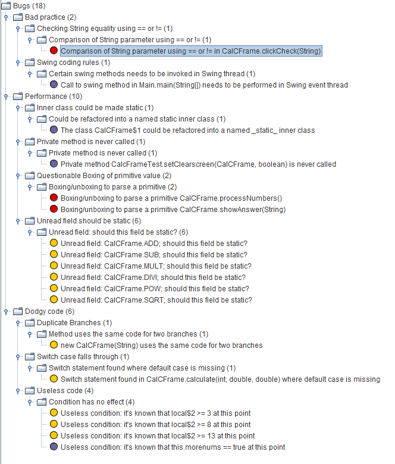
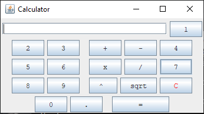

# Lab 07

| Outline | Value |
| --- | --- |
| Course | SEG 3103 |
| Date | Summer 2021 |
| Professor | Andrew Forward, aforward@uottawa.ca |
| TAs | Zahra Kakavand, zkaka044@uottawa.ca & Henry Chen, zchen229@uottawa.ca |
| Student | Youcef Ben Ali - 300110797 |

## Deliverables

* https://github.com/YoucefBenAli/seg3103_playground


------
## Part 1: Initial Bugs and fixes

Initial Bugs



Proof of the application running



### Bug1: Comparison of String parameter using == or !=

Fixed with code changing line 373
```
//Initial
if ( s == "" )
//Altered
if ( s.equals("") )
```


### Bug2: Certain swing methods needs to be invoked in Swing thread

To fix this bug we need to make sure we don't call it from the main method and call it during a swing event thread. This is according to the bug analysis

### Bug3: The class CalCFrame$1 could be refactored into a named _static_ inner class

If an inner class does not need the or reference the specific parent class that made it, as in using references to any other parent class rather than the specific instance that made it would not change the functionality. Then in that case the bug here is that making a inner class for each parent instance is a waste of memory and using a static class for all instances would be much better. 

### Bug4: Private method CalcFrameTest.setClearscreen(CalCFrame, boolean) is never called
After checking the code, I noticed we only have one test which is doNothing and the private method is completely useless. So I removed the code.

### Bug5: Boxing/unboxing to parse a primitive CalCFrame.processNumbers()
Changed code:
```
//Any time the following code is found its replaced with the latter

//Initial
Double.valueOf( input ).doubleValue();
//Edited
Double.parseDouble( input );  
```

### Bug6:Boxing/unboxing to parse a primitive CalCFrame.showAnswer(String)

Same as Bug 5

### Bug7:Unread field: should this field be static? (6) One for each of the calculator operations

Made the variables on line 37 static

### Bug8:new CalCFrame(String) uses the same code for two branches

Removed extra code.

```
//Before change
    buttons[i] = new JButton( buttonText[i] );   
    buttons[i].setFont( buttonfont );
    buttons[i].addActionListener( this );

    if ( i <= 2 )
        getContentPane().add( buttons[i] );
    else if ( i >= 3 && i <= 7)
        getContentPane().add( buttons[i] );
    else if ( i >=8 && i <= 12 )
        getContentPane().add( buttons[i] );
    else if ( i >= 13 && i <= 17 )
        getContentPane().add( buttons[i] );
    else
        getContentPane().add( buttons[i] );
       

//After change

    buttons[i] = new JButton( buttonText[i] );   
    buttons[i].setFont( buttonfont );
    buttons[i].addActionListener( this );
    
    getContentPane().add( buttons[i] );
```

### Bug9:Switch statement found in CalCFrame.calculate(int, double, double) where default case is missing

```
//Initial Code
        switch( oper ) {
          case ADD:            
            answer = number1 + number2; 
            break;
          case SUB:            
            answer = number1 - number2;
            break;
          case MULT:
            answer = number1 * number2;
            break;
          case DIVI:
            answer = number1 / number2;
            break;
          case POW:
            answer = Math.pow( number1, number2 );
            break;
          case SQRT:
            answer = Math.sqrt( number1 );
            break;
//After change
        switch( oper ) {
          case ADD:            
            answer = number1 + number2; 
            break;
          case SUB:            
            answer = number1 - number2;
            break;
          case MULT:
            answer = number1 * number2;
            break;
          case DIVI:
            answer = number1 / number2;
            break;
          case POW:
            answer = Math.pow( number1, number2 );
            break;
          case SQRT:
            answer = Math.sqrt( number1 );
            break;
          default:
            break;
```

### Bug10: Useless condition: it's known that this.morenums == true at this point
Since its known that the variable morenums is true at this point we don't need to check that condition

```
//Initial
else if (morenums) { 
      
      if ( equals ) {
       
        newoper = oper;
        morenums = false;
        firstpress = true;  // if equals is pressed set firstpress to false
    }
}

//After change
else { 
      
      if ( equals ) {
       
        newoper = oper;
        morenums = false;
        firstpress = true;  // if equals is pressed set firstpress to false
    }
}
```


## Part2: After fixing bugs


The only 2 remaining bugs are the ones I explained how to fix (Bug 2) and the one I explained what the bug is (Bug 3)